# MyTrader Bot Flow Diagram

This document provides a comprehensive flow diagram of the MyTrader bot, showing every decision point from initialization to trade execution, including when the bot decides to buy/sell, set stop-loss, take profit, and exit positions.

## Table of Contents
1. [Bot Initialization Flow](#bot-initialization-flow)
2. [Main Trading Loop Flow](#main-trading-loop-flow)
3. [Signal Generation Flow](#signal-generation-flow)
4. [Strategy Selection Flow](#strategy-selection-flow)
5. [Risk Management & Position Sizing](#risk-management--position-sizing)
6. [Entry Signal Decision](#entry-signal-decision)
7. [Stop-Loss & Take-Profit Calculation](#stop-loss--take-profit-calculation)
8. [Exit Signal Decision](#exit-signal-decision)
9. [LLM/RAG Enhancement Flow](#llmrag-enhancement-flow)
10. [Order Execution Flow](#order-execution-flow)

---

## 1. Bot Initialization Flow

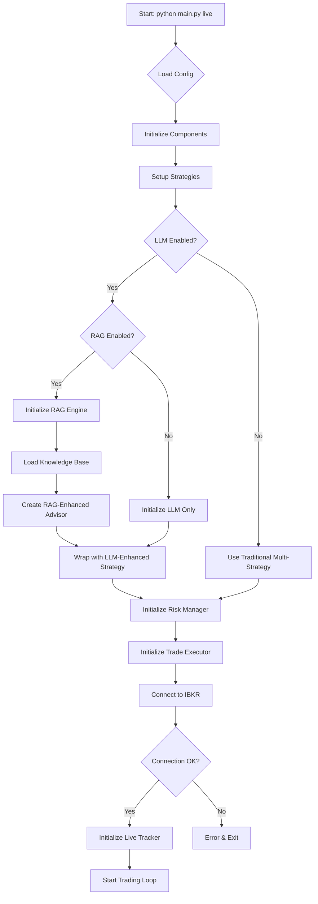

**Key Initialization Points:**
- **Line 38-162 (main.py)**: Initializes strategies, RAG engine (if enabled), LLM client, and wraps base strategy
- **Line 169**: Initializes RiskManager with Kelly Criterion support
- **Line 184-200**: Connects to Interactive Brokers (IBKR)
- **Line 203-215**: Sets up trade executor with event handlers

---

## 2. Main Trading Loop Flow

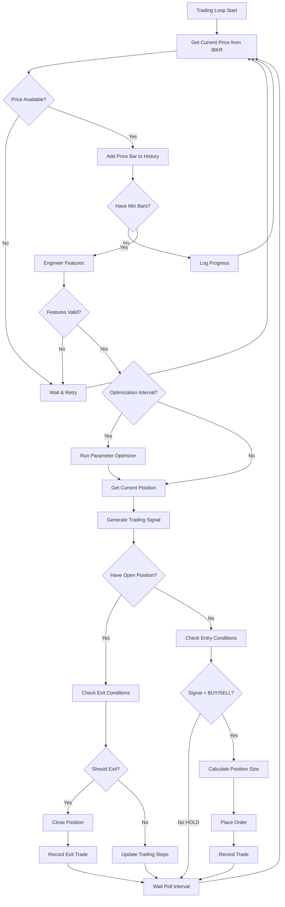

**Key Loop Points:**
- **Line 231-554 (main.py)**: Main trading loop with 5-second poll interval
- **Line 234-238**: Get current market price from IBKR
- **Line 242-253**: Build price history (minimum 15 bars needed)
- **Line 268-279**: Engineer technical features from price data
- **Line 285-293**: Periodic parameter optimization
- **Line 297-299**: Get current position before signal generation

---

## 3. Signal Generation Flow

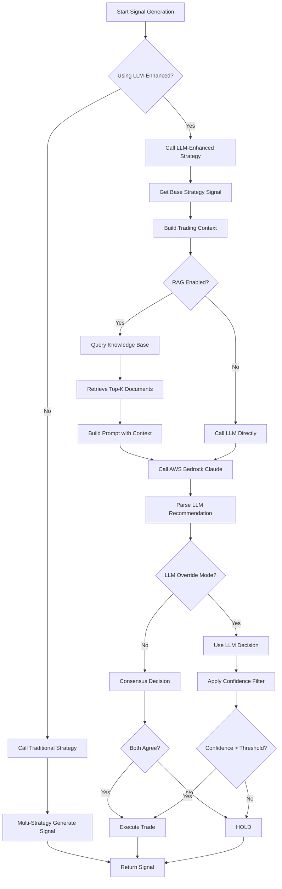

**Key Signal Generation Points:**
- **Line 302-366 (main.py)**: Signal generation with error handling
- **Line 305-313**: LLM-enhanced strategy path
- **Line 328-353**: Traditional multi-strategy path
- **Line 80-142 (llm_enhanced_strategy.py)**: LLM enhancement logic
- **Line 95-215 (multi_strategy.py)**: Traditional signal generation with validation

---

## 4. Strategy Selection Flow

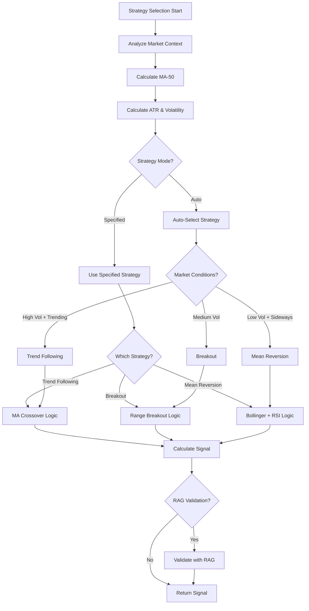

**Key Strategy Selection Points:**
- **Line 51-93 (multi_strategy.py)**: Market context analysis
- **Line 161-164**: Auto-select best strategy
- **Line 573-590**: Auto-selection logic based on market conditions
- **Line 168-176**: Route to specific strategy implementation

---

## 5. Risk Management & Position Sizing

```mermaid
flowchart TD
    A[Position Sizing Start] --> B[Get Account Value]
    B --> C[Get Signal Confidence]
    C --> D{Sizing Method?}
    D -->|Kelly Criterion| E[Calculate Kelly %]
    D -->|Fixed Fraction| F[Use Confidence-Based %]
    E --> G[Get Win Rate]
    G --> H[Get Avg Win/Loss]
    H --> I[Kelly = W - (1-W)/R]
    I --> J[Calculate Contracts]
    F --> K[Risk = Confidence * 0.01]
    K --> J
    J --> L[Apply Risk Limits]
    L --> M{Check Max Position?}
    M -->|Exceeds| N[Cap at Max Size]
    M -->|OK| O{Check Daily Loss?}
    N --> O
    O -->|Exceeded| P[Reject Trade]
    O -->|OK| Q{Check Daily Trades?}
    Q -->|Exceeded| P
    Q -->|OK| R[Calculate Position Size]
    R --> S[Apply Position Scaler]
    S --> T[Return Final Size]
```

**Key Risk Management Points:**
- **Line 436-454 (main.py)**: Position sizing with Kelly Criterion
- **Line 82-98 (risk/manager.py)**: Position size calculation
- **Line 65-73**: Risk limit checks (max daily trades, max position size, max daily loss)
- **Line 448-452**: Apply position scaler from signal metadata

---

## 6. Entry Signal Decision

### 6.1 Trend Following Strategy

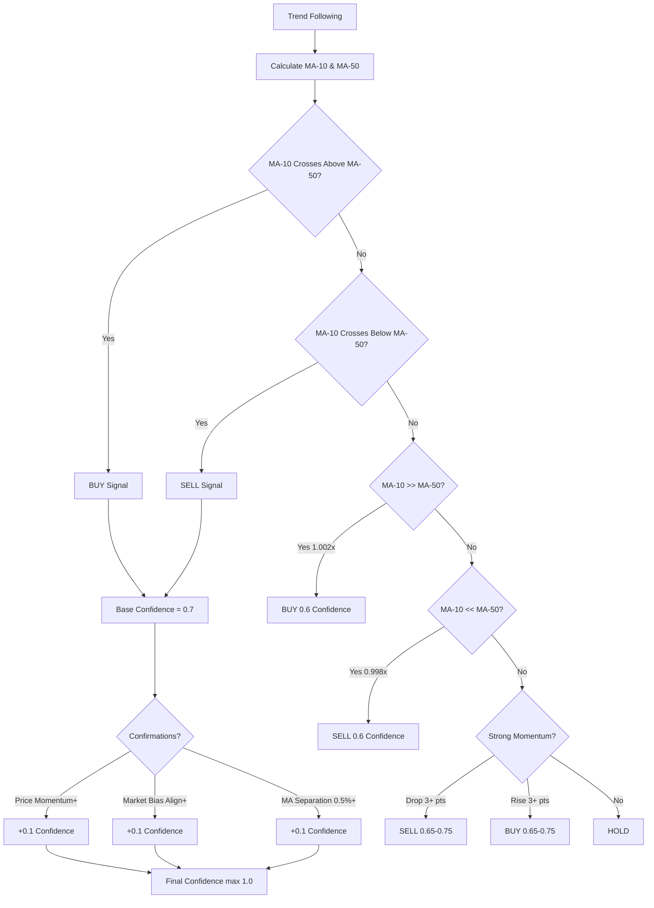

**Key Points:**
- **Line 337-421 (multi_strategy.py)**: Trend following implementation
- **Line 356-357**: Crossover detection
- **Line 393-420**: Strong momentum detection (3+ point moves on ES)

### 6.2 Breakout Strategy

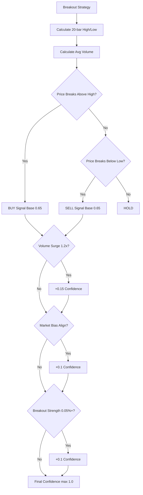

**Key Points:**
- **Line 423-484 (multi_strategy.py)**: Breakout strategy implementation
- **Line 430-432**: 20-bar rolling high/low calculation
- **Line 447-449**: Breakout detection with volume confirmation
- **Line 464-465**: Breakout strength threshold (0.05% for ES sensitivity)

### 6.3 Mean Reversion Strategy

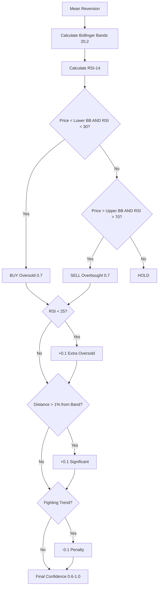

**Key Points:**
- **Line 486-543 (multi_strategy.py)**: Mean reversion implementation
- **Line 493-496**: Bollinger Bands calculation
- **Line 499**: RSI calculation
- **Line 508-524**: Oversold condition (price < lower BB AND RSI < 30)
- **Line 527-540**: Overbought condition (price > upper BB AND RSI > 70)

---

## 7. Stop-Loss & Take-Profit Calculation

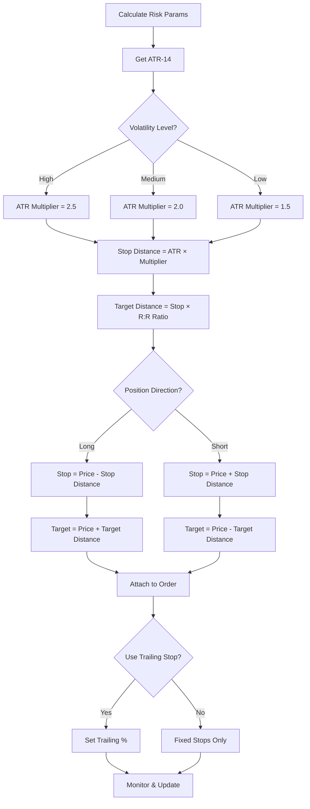

**Key Stop-Loss & Take-Profit Points:**
- **Line 545-571 (multi_strategy.py)**: Calculate ATR-based stops
- **Line 554-559**: Volatility-based ATR multiplier (1.5x-2.5x)
- **Line 561-562**: Stop and target distance calculation
- **Line 461-509 (main.py)**: Live trading stop/target calculation
- **Line 476-491**: Stop-loss calculation priority (metadata → ATR-based → default)
- **Line 493-507**: Take-profit calculation using risk:reward ratio

**Default Settings:**
- **Reward:Risk Ratio**: 2.0 (default, configurable)
- **Trailing Stop**: 0.5% (if enabled)
- **Stop Loss Ticks**: From config (e.g., 4 ticks for ES)
- **Take Profit Ticks**: From config (e.g., 8 ticks for ES)

---

## 8. Exit Signal Decision

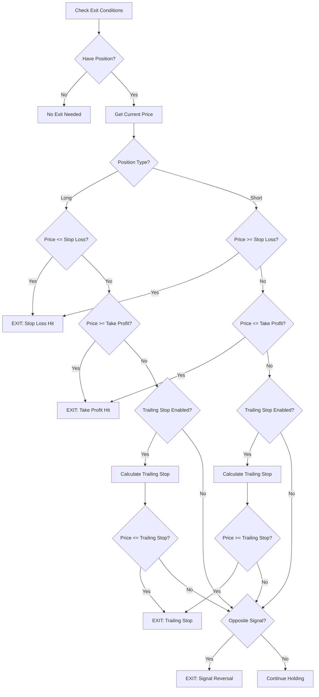

**Key Exit Decision Points:**
- **Line 369-398 (main.py)**: Live trading exit condition checks
- **Line 375-397**: Exit via stop-loss, take-profit, or risk params
- **Line 401-402**: Update trailing stops with current price and ATR
- **Line 404-422**: Exit on opposite signal
- **Line 616-677 (multi_strategy.py)**: Exit position logic
- **Line 641-657**: Long position exits (stop-loss, take-profit, trailing)
- **Line 659-676**: Short position exits (stop-loss, take-profit, trailing)

**Exit Reasons:**
1. **Stop Loss Hit**: Price reaches stop-loss level
2. **Take Profit Hit**: Price reaches take-profit target
3. **Trailing Stop Hit**: Price retraces from peak/trough
4. **Signal Reversal**: Opposite signal generated (BUY→SELL or SELL→BUY)
5. **Manual Exit**: (not in automated flow)

---

## 9. LLM/RAG Enhancement Flow

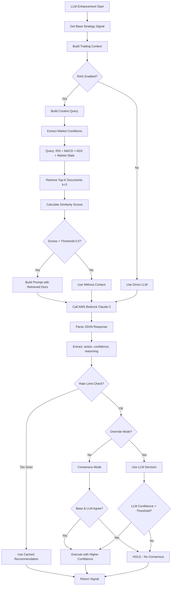

**Key LLM/RAG Points:**
- **Line 55-162 (main.py)**: RAG and LLM initialization
- **Line 74-104**: RAG engine setup with knowledge base
- **Line 106-129**: RAG-enhanced advisor creation
- **Line 79-167 (rag_trade_advisor.py)**: Context query building
- **Line 169-261**: RAG-enhanced signal enhancement
- **Line 119-123 (llm_enhanced_strategy.py)**: LLM signal enhancement call
- **Line 126-134**: LLM metadata attachment

**RAG Configuration:**
- **Top-K Documents**: 3 (configurable)
- **Similarity Threshold**: 0.5 (configurable)
- **Call Interval**: 60 seconds (rate limiting)
- **Min Confidence**: 0.7 (configurable)
- **Override Mode**: True/False (configurable)

---

## 10. Order Execution Flow

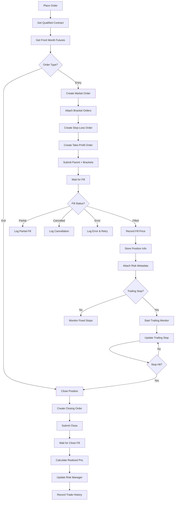

**Key Order Execution Points:**
- **Line 515-530 (main.py)**: Place order with bracket orders
- **Line 203-215 (main.py)**: Setup executor event handlers
- **Line 283-368 (ib_executor.py)**: Order placement implementation
- **Line 370-394**: Bracket order creation (stop-loss + take-profit)
- **Line 436-485**: Position closing logic
- **Line 487-532**: Trailing stop updates
- **Line 534-583**: Order status monitoring

**Order Events:**
1. **Order Submitted**: Order sent to IBKR
2. **Pre-Submitted**: Order acknowledged by IBKR
3. **Submitted**: Order active in market
4. **Filled**: Order executed (full or partial)
5. **Cancelled**: Order cancelled
6. **Inactive**: Order rejected or error

---

## Complete Decision Flow Summary

### When Bot Decides to BUY:

1. **Data Collection**: Collect minimum 15 price bars
2. **Feature Engineering**: Calculate technical indicators (RSI, MACD, ATR, MA, BB)
3. **Market Context**: Analyze trend (bullish/bearish/neutral) and volatility (high/medium/low)
4. **Strategy Selection**: Auto-select or use specified strategy
5. **Signal Generation**:
   - **Trend Following**: MA-10 crosses above MA-50, or strong upward momentum (3+ point rise)
   - **Breakout**: Price breaks above 20-bar high with volume confirmation
   - **Mean Reversion**: Price below lower Bollinger Band AND RSI < 30 (oversold)
6. **Confidence Calculation**: Base confidence + confirmations (0.6-1.0)
7. **RAG Validation** (if enabled): Query knowledge base and validate signal
8. **LLM Enhancement** (if enabled): Get LLM recommendation with retrieved context
9. **Consensus Check**: Ensure signal meets minimum confidence threshold (default 0.75)
10. **Risk Check**: Verify daily loss limit, max trades, max position size not exceeded
11. **Position Sizing**: Calculate contracts using Kelly Criterion or fixed fraction
12. **Execute BUY**: Place market order with stop-loss and take-profit brackets

### When Bot Decides to SELL:

1. **Data Collection**: Same as BUY
2. **Feature Engineering**: Same as BUY
3. **Market Context**: Same as BUY
4. **Strategy Selection**: Same as BUY
5. **Signal Generation**:
   - **Trend Following**: MA-10 crosses below MA-50, or strong downward momentum (3+ point drop)
   - **Breakout**: Price breaks below 20-bar low with volume confirmation
   - **Mean Reversion**: Price above upper Bollinger Band AND RSI > 70 (overbought)
6. **Confidence Calculation**: Same as BUY
7. **RAG Validation**: Same as BUY
8. **LLM Enhancement**: Same as BUY
9. **Consensus Check**: Same as BUY
10. **Risk Check**: Same as BUY
11. **Position Sizing**: Same as BUY
12. **Execute SELL**: Place market order with stop-loss and take-profit brackets

### When Bot Sets Stop-Loss:

**Calculation Priority:**
1. **Explicit Price** (if provided in metadata)
2. **ATR-Based** (ATR × Multiplier based on volatility):
   - High volatility: ATR × 2.5
   - Medium volatility: ATR × 2.0
   - Low volatility: ATR × 1.5
3. **Default Ticks** (from config, e.g., 4 ticks for ES)

**Long Position Stop**: Entry Price - Stop Distance
**Short Position Stop**: Entry Price + Stop Distance

### When Bot Takes Profit:

**Calculation Priority:**
1. **Explicit Price** (if provided in metadata)
2. **Risk:Reward Based**: Stop Distance × R:R Ratio (default 2.0)
3. **Default Ticks** (from config, e.g., 8 ticks for ES)

**Long Position Target**: Entry Price + Target Distance
**Short Position Target**: Entry Price - Target Distance

### When Bot Trails Stop:

**If Trailing Stop Enabled:**
1. **ATR-Based Trailing**: Trail at ATR × multiplier from current price
2. **Percentage-Based Trailing**: Trail at percentage (default 0.5%) from peak profit
3. **Update Frequency**: Every trading loop iteration (5 seconds)
4. **Only Moves Favorable**: Stop only tightens, never loosens

**Long Position**: Trailing stop = max(current stop, price - trail distance)
**Short Position**: Trailing stop = min(current stop, price + trail distance)

### When Bot Exits Position:

**Exit Conditions (checked in order):**
1. **Stop-Loss Hit**: Current price <= stop-loss (long) or >= stop-loss (short)
2. **Take-Profit Hit**: Current price >= take-profit (long) or <= take-profit (short)
3. **Trailing Stop Hit**: Current price <= trailing stop (long) or >= trailing stop (short)
4. **Opposite Signal**: New signal opposite to current position direction
5. **Error/Disconnect**: Connection loss or critical error

**Exit Process:**
1. Detect exit condition
2. Log exit reason
3. Close position at market
4. Calculate realized PnL
5. Update risk manager statistics
6. Record trade in history
7. Clear position state
8. Resume monitoring for new entries

---

## File Reference Map

- **Main Entry**: `main.py` (lines 38-562)
- **Multi-Strategy**: `mytrader/strategies/multi_strategy.py` (lines 1-677)
- **LLM Enhancement**: `mytrader/strategies/llm_enhanced_strategy.py` (lines 1-170)
- **RAG Advisor**: `mytrader/llm/rag_trade_advisor.py` (lines 1-300)
- **Risk Manager**: `mytrader/risk/manager.py` (lines 1-130)
- **Trade Executor**: `mytrader/execution/ib_executor.py` (lines 1-600)
- **Backtest Engine**: `mytrader/backtesting/engine.py` (lines 1-250)

---

## Configuration Parameters

| Parameter | Default | Description |
|-----------|---------|-------------|
| **Strategy Mode** | `auto` | Strategy selection: `trend_following`, `breakout`, `mean_reversion`, `auto` |
| **Reward:Risk Ratio** | `2.0` | Take-profit to stop-loss ratio |
| **Trailing Stop %** | `0.5` | Trailing stop percentage from peak |
| **Min Confidence** | `0.75` | Minimum confidence threshold for trades |
| **Poll Interval** | `5` seconds | Time between price checks |
| **Min Bars** | `15` | Minimum bars needed before trading |
| **Max Position Size** | Config | Maximum contracts per trade |
| **Max Daily Trades** | Config | Maximum trades per day |
| **Max Daily Loss** | Config | Maximum loss per day (risk limit) |
| **Position Sizing** | `kelly` | Method: `kelly` or `fixed_fraction` |
| **LLM Model** | `claude-3-sonnet` | AWS Bedrock model |
| **RAG Top-K** | `3` | Documents retrieved per query |
| **RAG Threshold** | `0.5` | Minimum similarity score |
| **LLM Call Interval** | `60` seconds | Rate limiting between LLM calls |
| **LLM Override Mode** | `True` | Allow LLM to override traditional signals |

---

## Notes

- **Live Trading**: Uses IBKR API for real-time data and execution
- **Backtesting**: Vectorized backtesting engine with same decision logic
- **Paper Trading**: Same code runs in paper mode via IBKR Paper account
- **Error Handling**: Comprehensive safeguards and validation at every step
- **Logging**: Detailed logging of all decisions and executions
- **Performance Tracking**: Real-time PnL, Sharpe ratio, win rate, and drawdown monitoring

---

*This document reflects the current implementation as of the codebase analysis. For code updates, refer to the individual module files listed in the File Reference Map.*
