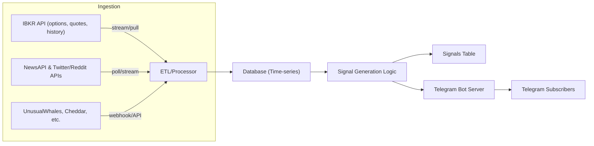

# SPY Options Signal Generator – Architecture and Design

**Executive Summary:** We design a system that ingests SPY option chain data via IB’s API, augments it with external data (volumes, open interest, unusual flow, sentiment from news/social), and applies rule-based, statistical or ML logic to generate trade signals.  These signals are sent via Telegram (no order execution).  Key IB endpoints include `/iserver/secdef/search`, `/strikes`, `/info` (for contract details) and `/iserver/marketdata/snapshot` (live quotes)【9†L643-L652】【18†L735-L744】.  Historical data is fetched from `/iserver/marketdata/history` or `/hmds/history`.  Greeks (delta, theta, etc.) can be obtained via IB’s TWS API (`tickOptionComputation`)【44†L133-L142】 or computed from prices.  External sources include exchange or data-provider feeds for option volume/open-interest, and “options flow” APIs like UnusualWhales (100+ endpoints for flow, dark pools, volatility)【55†L190-L198】.  Sentiment is drawn from News APIs (e.g. NewsAPI.org【51†L169-L172】) and social media (Twitter, Reddit – studies show Twitter sentiment strongly predicts stock moves【53†L383-L390】).  Data flows through an ETL pipeline (e.g. Kafka, database), triggering signal logic and Telegram alerts.  We include schema designs, algorithm comparisons, Mermaid diagrams, and code snippets (IB data fetch, Telegram send).  Regulatory cautions (data licensing, investment advice rules) are noted; IB’s docs stress compliance with registration requirements for automated trading offerings【16†L521-L529】.

## 1. IB API Endpoints and SPY Options Fields

To build the SPY option chain and market data, we use IB’s Client Portal (REST) and/or TWS/Gateway API:

- **Option chain/contract lookup:** Use the Client Portal endpoints `/iserver/secdef/search`, `/iserver/secdef/strikes`, and `/iserver/secdef/info` to retrieve SPY options.  For example, a GET to `/iserver/secdef/search?symbol=SPY&sectype=STK` returns the SPY *conid*.  Then `/iserver/secdef/strikes?conid={SPY_conid}&secType=OPT&month=MMMYY&exchange=SMART` yields available strikes for a given expiry【9†L643-L652】.  Finally `/iserver/secdef/info` returns each option’s details: `conid`, `symbol`, `strike`, `right` (C/P), `maturityDate`, `multiplier`, etc.  Table 1 summarizes the key IB endpoints:

  | **Endpoint**                     | **Method** | **Purpose**                          | **Key Fields Returned**                                   |
  |----------------------------------|------------|--------------------------------------|-----------------------------------------------------------|
  | `/iserver/secdef/search`         | POST/GET   | Find underlying contract (SPY).      | `conid` (instrument ID), `symbol`, `sections` with exp.   |
  | `/iserver/secdef/strikes`        | GET        | List strikes for a conid + expiry.   | `call`[] and `put`[] strike lists.                       |
  | `/iserver/secdef/info`           | GET        | Get option contract details.         | `conid`, `symbol`, `secType`, `right`, `strike`, `currency`, `maturityDate`, `multiplier`, `tradingClass`, etc.【9†L675-L684】. |
  | `/iserver/marketdata/snapshot`   | GET        | Top-of-book live quotes (snapshot).  | Custom fields (e.g. `31`=last, `84`=bid, `86`=ask, `85`=bidSize, `88`=askSize, etc)【18†L782-L791】. |
  | `/iserver/marketdata/history`    | GET        | Historical price/vol bars.          | OHLC bars over period (no bid/ask by default).            |
  | (TWS API) `reqTickers` / tickers | Streaming  | Live quotes via TWS/Gateway stream.  | Bid/Ask/Last (fields similar to snapshot).              |
  | (TWS API) `calculateOptionPrice`/`tickOptionComputation` | Streaming  | Option Greeks (IV, delta, gamma, theta, etc)【44†L133-L142】.  | `impliedVolatility`, `delta`, `gamma`, `theta`, `vega`.  |

【9†L643-L652】【9†L675-L684】【18†L782-L791】 illustrate using `/strikes` and `/info` to build a contract library.  For example, after obtaining SPY’s `conid`, one might call:
```python
import requests
resp = requests.post("https://localhost:5001/v1/api/iserver/secdef/search?symbol=SPY&sectype=STK", verify=False)
data = resp.json()
spy_conid = data[0]['conid']
```
Then retrieve strikes and infos:
```python
strikes = requests.get(f"https://localhost:5001/v1/api/iserver/secdef/strikes?conid={spy_conid}&secType=OPT&month=JUN26&exchange=SMART").json()
contract = requests.get(f"https://localhost:5001/v1/api/iserver/secdef/info?conid={spy_conid}&secType=OPT&month=JUN26&strike=450&right=C&exchange=SMART").json()
```
These return the SPY chain details (expiry June 2026, strike 450C, etc.)【9†L667-L676】【9†L703-L712】.

**Real-time quotes & Greeks:** Once we have an option’s `conid`, we use `/marketdata/snapshot` to get live bid/ask/last. IB requires a “pre-flight” subscription by including the desired field tags in the initial call【18†L735-L744】. For example:
```python
# Subscribe to fields once
url = f"https://api.ibkr.com/v1/api/iserver/marketdata/snapshot?conids={spy_conid}&fields=31,84,85,86,88"
requests.get(url)  # returns ["conid": ...] but starts the stream
# Then fetch snapshot:
resp = requests.get(f"https://api.ibkr.com/v1/api/iserver/marketdata/snapshot?conids={spy_conid}")
print(resp.json())
```
The JSON response shows field 31 as last price, 84=bid, 86=ask, 85=bid size, 88=ask size, etc.【18†L782-L791】.  For example, IB’s docs show:
```
[
  {
    "31": "168.42",   // Last price
    "84": "168.41",   // Bid
    "85": "600",      // Bid size
    "86": "168.42",   // Ask
    "88": "1300",     // Ask size
    "...": ...
  }
]
```
These numeric field codes map to standard market data: e.g. 31=LAST, 84=BID, 86=ASK【23†L698-L703】【18†L782-L791】.

**Historical data:** The `/iserver/marketdata/history` (or beta `/hmds/history`) returns time-series bars. It accepts parameters like `period=1w`, `bar=5m`, `exchange`, etc. (These endpoints have stricter limits: e.g. max 5 concurrent calls, 1000 rows per request【16†L629-L632】.)  Note volume fields may be limited.  Alternatively, one can use the TWS API (`reqHistoricalData`) for minute bars on SPY or options for backtesting.

**Greeks:** IB’s REST API does not directly supply Greeks for options.  The TWS API can compute them on the fly: calling `calculateOptionPrice(...)` triggers IB’s option model and returns data via `tickOptionComputation`, which includes implied volatility, delta, gamma, vega, theta, etc.【44†L133-L142】.  For example, IB’s example shows `tickOptionComputation` with `impliedVolatility`, `delta`, and `theta` fields【44†L133-L142】.  We can either use TWS/Gateway (via `ib_insync` or native API) for streaming Greeks, or compute Black–Scholes Greeks ourselves using the option’s current mid price and volatility inputs.

<table>
<thead>
<tr><th>Feature</th><th>IB REST API</th><th>TWS/Gateway API</th></tr>
</thead>
<tbody>
<tr><td>Option chain</td><td>/secdef/search, /strikes, /info (option details: conid, strike, right, expiry, multiplier, etc)【9†L675-L684】</td><td>reqSecDefOptParams, reqContractDetails (similar)</td></tr>
<tr><td>Top-of-book quotes</td><td>/marketdata/snapshot (tags for bid, ask, last, size)【18†L782-L791】</td><td>reqTickers or reqMktData (streaming quotes)</td></tr>
<tr><td>Historical bars</td><td>/marketdata/history (periodic OHLC)</td><td>reqHistoricalData</td></tr>
<tr><td>Option Greeks</td><td>– (REST does not provide Greeks directly)</td><td>calculateOptionPrice + tickOptionComputation (returns IV, delta, gamma, theta)【44†L133-L142】</td></tr>
<tr><td>Rate limits</td><td>10 req/s per user globally; **history** GET: max 5 concurrent【16†L586-L594】【16†L629-L632】</td><td>Depends on TWS throttle (few req/s)</td></tr>
</tbody>
</table>

> **Table 1:** *Key IB API endpoints and data fields for retrieving SPY options (chains, quotes, historical data).* Citations: IB docs and Campus articles【9†L643-L652】【18†L782-L791】.  IB enforces rate limits (e.g. 10 req/s)【16†L586-L594】.

## 2. External Data Sources

To enrich signals, we ingest additional data beyond IB:

- **Volume & Open Interest:** IB’s data stream shows traded volume on quotes, but not the full daily OI.   For comprehensive volume and open interest, consider:
  - **Options Clearing Corp (OCC) / CBOE Data:** OCC publishes end-of-day OI & volume for all US equity options (via CBOE’s data shop or free OCC website).  These can be loaded daily.  If an API is needed, services like **Tiingo** or **EODHistoricalData** offer options data (for a fee).  Databento provides high-quality historical option chains (with OI) via API or files (e.g. for SPY, though paid)【48†L0-L1】.
  - **Broker feed:** Some brokers (IB, TDA) may supply volume/OI via their APIs (though OI might be missing).
  - **UnusualWhales (OW) / Massive / Polygon:** UnusualWhales API (and others) can provide aggregated volume/OI metrics. For example, OW’s “OI Change”, “Volume Profile” endpoints【55†L213-L222】 can be used (at $250/mo for full market data).
  
- **Options Flow (Unusual Options Activity):** We track unusual large orders (“sweepers”, etc). Leading services:
  - **UnusualWhales:** Provides 100+ endpoints (flow alerts, dark pool, Greek exposure, volatility)【55†L190-L198】 via REST, WebSocket or Kafka.  For example, OW’s “Flow Alerts” or “Recent Flows” endpoints highlight big trades.  OW costs ~$50–$250/mo depending on data depth.
  - **Cheddar Flow:** A popular flow tracker (API not public, UI-only, ~$85–99/mo).
  - **Optionsonar, FlowAlgo, LiveVol:** Other vendors with APIs for unusual flow (often at enterprise prices).
  - **Social sources:** FinTwit, Discord groups—manual or web-scrape (non-official).
  
- **Implied Volatility & Vol Metrics:** We often want index vol (VIX, SPX), or option-chain IV data.
  - **CBOE VIX:** Publicly available (CBOE or Yahoo).
  - **OptionMetrics/Orats:** Paid historical IV surfaces.
  - **UnusualWhales / EOD Data:** Some provide IV rank/IV term structures (e.g. OW has “IV Rank/Term Structure” endpoints【55†L214-L222】).
  - **In-house:** Derive IV from option mid-price using Black–Scholes, given underlying price and interest rates.
  
- **Sentiment (News, Social):** News and social sentiment can indicate broad market mood (important for SPY/EQ indices):
  - **News Feeds:** Use APIs like **NewsAPI.org**, Bloomberg API, or Reuters (often paid).  NewsAPI.org is free to start and aggregates thousands of sources【51†L169-L172】.  The raw news can be processed with NLP (e.g. a BERT model or Azure/Google NLP) to extract *bullish*/*bearish* sentiment scores on SPY or “S&P 500” keywords.
  - **Twitter (X):** Access requires API or scraping. Studies (e.g. Rossouw & Greyling) find Twitter mood predicts S&P 500 moves【53†L383-L390】.  One could track keywords like “SPY” or “market” and compute sentiment.  Caution: Twitter’s API is now restricted/paid, so alternatives (tweet scraping, third-party aggregators like TipRanks) or use sampled data.
  - **Reddit:** Subreddits like r/stocks, r/investing, r/wallstreetbets.  APIs: **PRAW** for live data (authenticated), or **Pushshift** for historical (though now login-required as of 2023【59†L6-L14】). NLP can yield sentiment indexes (e.g. number of positive vs negative posts per minute).
  - **News Sentiment Services:**  Tools like RavenPack or NewsAPI.ai offer sentiment scores for news headlines (often paid).
  
- **Economic Data / Macros:** Although not asked, some traders consider macro indicators (FRED data) as context (less directly used in SPY options signals but might be part of a broader strategy).
  
  | **Source Type**        | **Examples**                                      | **Data**                                     | **Access / Cost**                        |
  |------------------------|---------------------------------------------------|----------------------------------------------|-------------------------------------------|
  | Options Market Data    | IBKR API, TIingo, OptionMetrics, Databento, CBOE   | Live/historical quotes, OI, volume, IV       | IB API (free with account, limited), <br> Databento (paid), OptionMetrics (paid academic), <br> CBOE (paid data feed). |
  | Options Flow Services  | UnusualWhales, CheddarFlow, OptionFlow, Optionsonar | Unusual trades, sweeps, dark pool activity   | UnusualWhales (API) from \$50–250/mo【55†L190-L198】,<br> CheddarFlow (~\$85–99/mo), others vary. |
  | News Feeds             | NewsAPI.org, Google News, Bloomberg, Reuters      | Latest news headlines                        | NewsAPI (free tier),<br> Bloomberg/Reuters (expensive datafeeds). |
  | Social Media/Sentiment | Twitter API, Reddit API/Pushshift, StockTwits      | Social sentiment (posts, comments)           | Twitter API (restricted/paid),<br> Pushshift (free but now OAuth)【59†L6-L14】,<br> StockTwits (free API for stock chat, limited). |
  | NLP Sentiment Tools    | Azure/Google NLP, FinBERT, OpenAI (GPT)           | Sentiment scores on text/news               | Cloud NLP (metered),<br> OpenAI API (pay per usage). |
  | Market Indices         | CBOE (VIX), Yahoo Finance                         | VIX, S&P 500 index price                     | Public (free). |

> **Table 2:** *Recommended external data sources for options analytics and sentiment.*  We balance cost and freshness: IB data has minimal latency but may lack OI; premium APIs give deeper flow/greeks but cost \$\$\$. NewsAPI is free for development; Twitter/Reddit may require workarounds.  (Sources: IB docs【18†L782-L791】【55†L190-L198】, NewsAPI marketing【51†L169-L172】, sentiment research【53†L383-L390】.)

## 3. Data Ingestion & ETL Pipeline

**Architecture:** We propose a hybrid batch/stream pipeline (Figure 1).  Live data (IB quotes, option flow ticks, news tweets) flows through message queues (e.g. Kafka, RabbitMQ) into processing workers.  Batch data (historical bars, daily OI from OCC) are fetched via scheduled jobs (cron or Airflow).  All data lands in a time-series database (e.g. PostgreSQL/Timescale, InfluxDB) or data warehouse.  Downstream, a “Signal Engine” reads from the DB, applies logic, and writes signals to a **Signals** table (and publishes to Telegram).



> **Figure 1:** *Data flow and signal pipeline.* IB and external APIs feed an ETL layer that populates a database.  The Signal Engine queries this DB to generate signals, which are stored and sent via a Telegram bot to users.

**Latency & Frequency:**  
- *Real-time data:* IB market data and flow alerts are ingested as they arrive (sub-second latency). We aim to process in near real-time (~1-second cadence) for fast signals.  
- *Historical/batch:* OI/volume can be updated daily (after market close). News sentiment might be updated hourly or when major news breaks.

**ETL Details:**  
- **Staging:** Raw JSON from each API is normalized (field mapping, type conversions) and timestamped.  
- **Storage Schema:** A possible schema (SQL) is:  
  ```sql
  CREATE TABLE options_quotes (
    conid BIGINT,
    symbol TEXT,
    strike DOUBLE PRECISION,
    expiry DATE,
    right CHAR(1),
    bid DOUBLE PRECISION,
    ask DOUBLE PRECISION,
    last DOUBLE PRECISION,
    bid_size INTEGER,
    ask_size INTEGER,
    implied_vol DOUBLE PRECISION,
    delta DOUBLE PRECISION,
    theta DOUBLE PRECISION,
    vega DOUBLE PRECISION,
    volume BIGINT,
    open_interest BIGINT,
    ts TIMESTAMP WITHOUT TIME ZONE,
    PRIMARY KEY (conid, ts)
  );
  CREATE TABLE signals (
    id SERIAL PRIMARY KEY,
    created TIMESTAMP,
    type TEXT,              -- e.g. "BullCallSpread", "PutSweep"
    details JSONB,          -- e.g. {"strike": 450, "expiry": "2026-06-21", "side": "CALL", "action": "BUY"}
    score DOUBLE PRECISION, -- confidence or indicator value
    sent BOOLEAN DEFAULT FALSE
  );
  ```
  Each ingest appends to `options_quotes` (indexed by `conid, ts`).  The `signals` table stores generated alerts (once flagged, the bot sends and sets `sent=true`).  Other tables could include `underlying_prices (ts, price)`, `sentiment_scores`, etc.
- **ETL Tools:** We can use Python scripts (e.g. `ib_insync` or `requests` for REST) run in a persistent process or scheduled jobs.  For heavy throughput, a message queue (Kafka) can buffer tick data.  Batch ingestion (e.g. daily OI files) can use ETL frameworks or simple cron jobs.

## 4. Signal Generation Logic & Backtesting

**Approaches:** Signal generation can be rule-based or algorithmic.  Table 3 compares common strategies:

| **Method**           | **Description**                                                         | **Pros**                             | **Cons**                              |
|----------------------|-------------------------------------------------------------------------|--------------------------------------|---------------------------------------|
| **Rule-based thresholds**  | E.g. “if call volume > X and OI > Y at bid, signal bull call.”   | Simple, transparent, easy to implement. Intuitive. | Rigid; may miss patterns; prone to overfitting threshold. |
| **Statistical models**     | E.g. z-score on call/put volume ratio, volatility breakout signals.  | Captures trends, dynamic thresholds. | Requires parameter tuning; sensitive to data distribution shifts. |
| **Machine Learning**       | Classification/regression (tree, SVM, neural nets) using features (volumes, Greeks, sentiment). | Can uncover complex patterns; adaptive if retrained. | Needs training data; risk of overfitting; harder to explain. |
| **Time-series models**     | ARIMA, LSTM on signal/price series.                                  | Models temporal dependencies.       | Complex; requires large historical data; slower to adapt. |

> **Table 3:** *Signal algorithm types.*  Rule-based triggers (e.g. “IV rank >80% AND large put sweep → bearish signal”) are easy to codify. Statistical filters (e.g. Call/Put volume z-scores) adapt to market regimes. ML models (e.g. a random forest on 20 features) can combine many signals but need training labels (past profitable trades). 

**Example Rule:** “Generate a **Bull Call Spread** signal if SPY’s implied volatility is low (IV rank < 30%) but there is unusual **call sweep** volume on the top-of-book (e.g. 10x normal 30-day average).”  Or, “Signal a **Long Straddle** if both call and put volumes spike above 95th percentile simultaneously (indicating high uncertainty).”  

**Risk Filters:** To avoid bad signals: filter out periods of very low liquidity (thin market), extremely wide spreads, or major news/drift events.  For example, skip signals if SPY volatility is in the bottom 10% (lack of movement) or if market indicators (VIX, index-level RSI) are in extreme.  

**Backtesting:** We simulate signals on historical data to measure performance.  Ideally:
- Use **walk-forward testing**: train/tune on one period, test on the next. 
- Metrics: hit rate (% of signals that led to profitable move within a time window), average return per signal, maximum drawdown of simulated “followed signals”, Sharpe ratio.  Also track false positives/negatives.  
- We would avoid lookahead: e.g. only use data that would have been available at signal time.  
- For options signals, we test by “paper trading” the recommended trade (entry, stop-loss/take-profit), though here orders aren’t executed.

**Performance Monitoring:** We compute statistics daily/weekly on signal success. Alerts can be “backtested P&L fell below X” to flag model drift, requiring recalibration.

## 5. Telegram Delivery Design

**Bot Setup:**  We use the Telegram Bot API (via a bot token) to deliver messages.  No trading commands are sent—only informational alerts.  **Security:** Keep the bot token secret (e.g. in environment variables). Use HTTPS endpoints to call Telegram (no need to host a webhook if we push from server).  **Compliance:** Include disclaimers in messages (e.g. “This is not trading advice”).  Note: in many jurisdictions, recommending trades publicly can trigger licensing requirements.  We’d advise consulting legal counsel.

**Message Format:** Clear, concise alerts. For example:  
```
🚨 SPY Options Signal: Bull Call Spread
Buy 430C / Sell 440C exp 6/21 @ 2.10 (ATM Call sweep, low IV).  
Target: +50%, Stop: -30%. #SPY
```
Or for simple alerts:  
```
🚨 SPY Call Sweep Alert: 435C exp 6/21, 5000 contracts @ $1.20
```
Use emojis or text to highlight: 🚀, 🔔. The message should include underlying, strike, expiry, action, rationale.  

**User Segmentation:** If desired, maintain separate chat groups (e.g. `@publicSignals`, `@vipSignals`). The bot code can send different messages based on user roles or topics.  For security, only invite known subscribers.

**Throttling & Rate Limits:** Telegram’s Bot API allows ~30 messages/sec per bot, but if sending to many users/chats, beware limits. To be safe, queue messages and space them (e.g. max 20 messages/sec).  Implement exponential backoff on 429 errors.

**Example Telegram Send (Python):**  
```python
import requests
bot_token = "123456:ABC-DEF"  # Telegram bot token
chat_id = "-1001234567890"    # group or channel ID
text = "🚨 *SPY Options Alert:* Buy 435C exp 06/21 @ \$1.20 (Unusual flow) ➡️ Target +40%"
requests.get(f"https://api.telegram.org/bot{bot_token}/sendMessage",
             params={"chat_id": chat_id, "text": text, "parse_mode": "Markdown"})
```
This snippet sends a formatted Markdown message to a channel.  (No IB order API calls; simply sends text.)

## 6. Monitoring, Logging, Alerting

**Data Quality:** Continuously monitor data feeds.  Log missing ticks or API errors.  For example, if IB snapshots return empty or stale data, an alert should trigger (e.g. email or Slack).  Similarly, catch API errors (HTTP 429 rate-limit, 500 errors).  Store logs (via ELK stack or cloud logging) with timestamps.

**System Health:** Track process uptime and latency. Use metrics (e.g. Prometheus) to measure pipeline lag: e.g. “max age of latest quote” or “time since last news fetch.” Alert if lag > threshold.

**Signal Monitoring:** Maintain counters: signals generated per day, delivery failures. If many signals suddenly appear or drop to zero, send an alert.

**Anomaly Alerts:** If the algorithm’s P&L (paper) deviates (excess losses) or a manual check finds issues, notify developers. Automate alerts on exceptions or performance dips.

## 7. Technology Stack & Deployment

- **Languages/Libraries:** Python is ideal (rich financial libs, IB support). Use **ib_insync** for TWS (Python IB API wrapper), **requests/urllib3** for REST, **pandas** for data.  For ML, use **scikit-learn** or **XGBoost**.  NLP can use **NLTK**, **spaCy**, or **Transformers (Hugging Face)** for sentiment.
- **Data Storage:** PostgreSQL with TimescaleDB extension (or InfluxDB) for time-series.  Could also use SQLite for small scale.
- **Workflow Orchestration:** Cron jobs or Apache Airflow for scheduling batch tasks (daily data fetch, backtests).  A long-running Python service (or Node.js) for continuous data ingestion and Telegram sending.
- **Telegram API:** Python’s `python-telegram-bot` library, or direct `requests` as shown.
- **Deployment:** Containerize services with Docker.  Run on a cloud VM (AWS EC2, GCP Compute Engine) or a VPS.  Use `supervisor` or `systemd` to manage processes.  If high reliability needed, Kubernetes cluster.
- **Monitoring Stack:** Prometheus for metrics, Grafana dashboard; Sentry or CloudWatch for error alerts.
- **Development Tools:** Git for version control. If ML models, Jupyter notebooks for prototyping, then move code to production scripts.
  
## 8. Legal & Regulatory Considerations

- **Signal vs Advice:** Publicly broadcasting trade “signals” can be considered financial advice.  We must include disclaimers (“For informational use only; not a recommendation”).  If charging subscribers, securities laws (FINRA/SEC in US, or equivalents elsewhere) may apply.  IB warns that automated trading offerings need compliance approval【16†L521-L529】.  Our system should avoid taking any trades automatically – signals only.
- **Data Licensing:** Using data from IB requires an account and compliance with IB’s terms.  If using external APIs (e.g. UnusualWhales, NewsAPI), comply with their licenses (e.g. OW API is paid).  Scraping Twitter/Reddit beyond API limits may violate their terms.
- **Privacy:** We won’t handle user PII (only Telegram chat IDs).
- **Exchange Data Fees:** For SPY options tick data, ensure market data subscriptions if needed (IB requires paying for OPRA/SIPC if streaming live quotes).
  
## 9. Diagrams and Code Snippets

Below is a Mermaid flowchart illustrating the data pipeline and signal flow (Figure 2):

```mermaid
flowchart TD
    subgraph Data_Ingestion
      A[IB API: Option Chain & Market Data] --> ETL[ETL Pipeline];
      B[External APIs (News/Twitter, Flow)] --> ETL;
      C[Historical Data Feeds (OCC, VIX)] --> ETL;
    end
    ETL --> DB[(Time-Series Database)];
    DB --> Logic[Signal Generation Logic];
    Logic --> SignalsTable[(Signals Table)];
    Logic --> Telegram[Telegram Bot];
    Telegram --> Users[Telegram Subscribers];

    style DB fill:#ddf,stroke:#333,stroke-width:1px
    style Logic fill:#fdd,stroke:#333,stroke-width:1px
    style Telegram fill:#dfd,stroke:#333,stroke-width:1px
```

> **Figure 2:** *Pipeline flowchart.* IB and external feeds are processed by the ETL layer into a database. The Signal Logic reads from this database, writes signals to a table, and the Telegram bot reads signals to notify users.

**Example IB Data Retrieval (Python):**  
```python
import requests

# 1. Get SPY underlying conid
resp = requests.post(
    "https://localhost:5001/v1/api/iserver/secdef/search?symbol=SPY&sectype=STK",
    verify=False
)
spy_data = resp.json()[0]
spy_conid = spy_data['conid']

# 2. Subscribe to real-time quotes (bid/ask/last) via snapshot
fields = "31,84,85,86,88"  # last, bid, bidSize, ask, askSize
url = f"https://api.ibkr.com/v1/api/iserver/marketdata/snapshot?conids={spy_conid}&fields={fields}"
requests.get(url, verify=False)  # Initialize stream (no data returned)

# 3. Get a snapshot
snap = requests.get(f"https://api.ibkr.com/v1/api/iserver/marketdata/snapshot?conids={spy_conid}", verify=False)
data = snap.json()
print("SPY Bid:", data[0]['84'], "Ask:", data[0]['86'], "Last:", data[0]['31'])
```
This fetches SPY’s live quote. (For an option, replace `spy_conid` with the option’s `conid`.)

**Example Telegram Message Send (Python):**  
```python
import requests

bot_token = "123456:ABC-DEF"  # Telegram bot token
chat_id   = "@MySignalChannel"
message   = (
    "🔔 *SPY Options Signal: Bull Call Spread*\n"
    "Buy 435C / Sell 440C exp 06/21 @ $2.10\n"
    "_Reason:_ Unusual call sweep, low IV\n"
    "🎯 Target: +40%, ⚠️ Stop: -50%\n"
    "#SPY #Options"
)
requests.get(
    f"https://api.telegram.org/bot{bot_token}/sendMessage",
    params={"chat_id": chat_id, "text": message, "parse_mode": "Markdown"}
)
```
This constructs a rich alert with bold text and sends it to a Telegram channel. 

## 10. Conclusion

By leveraging IBKR’s API and integrating rich external datasets, we can build a robust SPY options signal generator. The design above outlines the necessary endpoints (chains, quotes, history), data architecture, signal algorithms, and delivery via Telegram.  Tables summarize data sources and methods; diagrams show data flow; code snippets illustrate key steps.  Compliance and monitoring are built in. This framework can be extended to other tickers or signal types as needed. 

**Sources:** Official IBKR documentation and articles【9†L643-L652】【18†L782-L791】; Unusual Whales API docs【55†L190-L198】; NewsAPI marketing【51†L169-L172】; academic study on Twitter sentiment in markets【53†L383-L390】; IB rate-limit notice【16†L586-L594】. Each data source and design choice is based on up-to-date (2024-2026) information as cited.